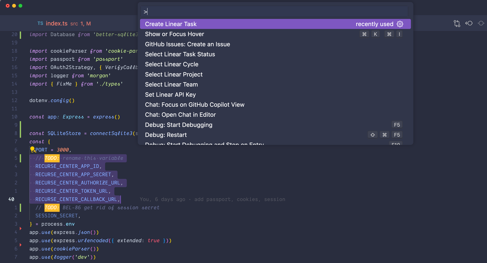
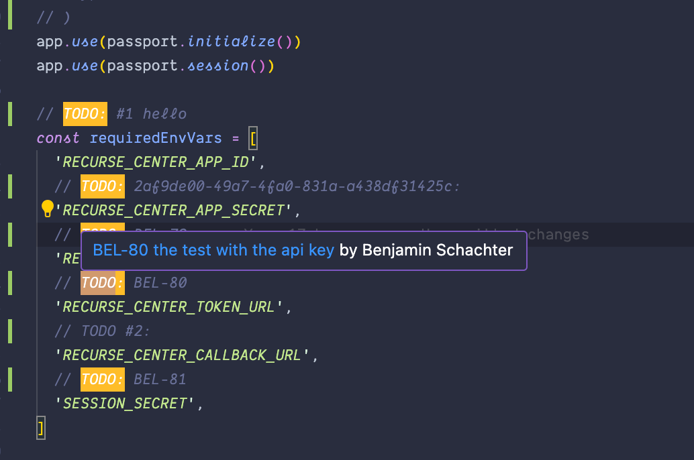
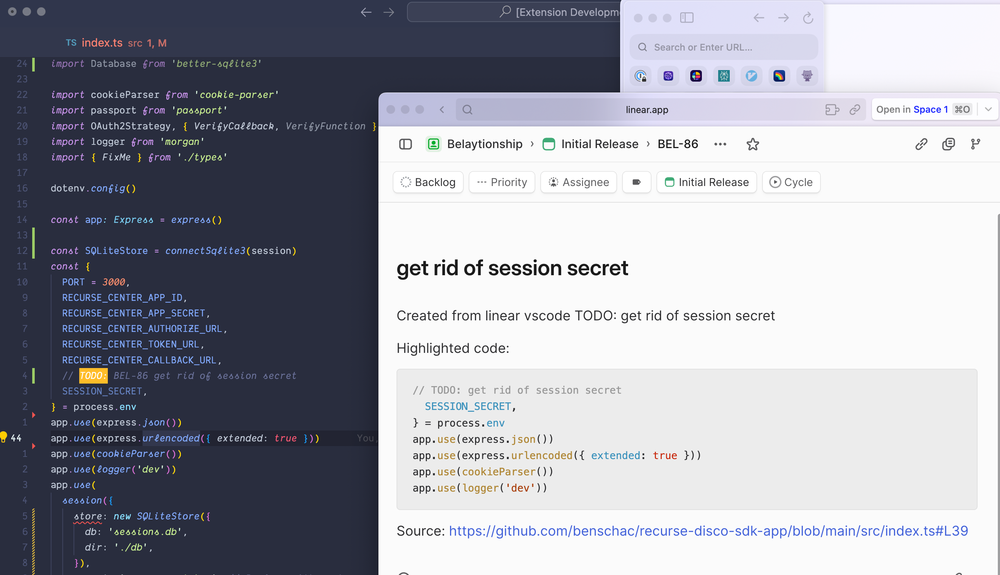
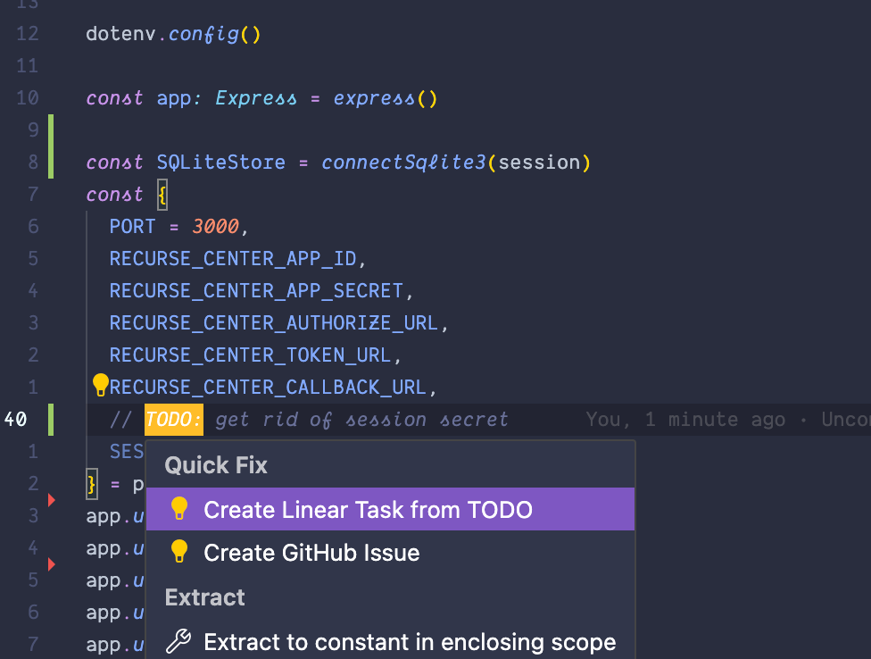

# Linear Task From TODO Comment

Create linear tasks from TODO: comments

Linear Task from TODO does not have access to any of your organizations data. All Linear API calls are handled via Linear SDK client-side.

## Features

- Create linear tasks from your TODO: comments directly in VSCode
- Add code blocks from highlighted code when generating code
- Deep link the code block from your Github repository
- Updates your TODO: comment with task ID of new linear task
- On TODO: hover, show deep link to linear task.
- Switch: Project, Cycle, Team of each linear task
- `cmd + .` quick action to create a linear task from highlighted TODO:

Describe specific features of your extension including screenshots of your extension in action. Image paths are relative to this README file.

For example if there is an image subfolder under your extension project workspace:

## Requirements

- [Linear.app](http://www.linear.app) account
- Linear App Personal API Key `https://linear.app/[org]/settings/api`

## Extension Settings

Include if your extension adds any VS Code settings through the `contributes.configuration` extension point.

For example:

This extension contributes the following settings:

- `myExtension.enable`: Enable/disable this extension.
- `myExtension.thing`: Set to `blah` to do something.

## Known Issues

## Following extension guidelines

Ensure that you've read through the extensions guidelines and follow the best practices for creating your extension.

- [Extension Guidelines](https://code.visualstudio.com/api/references/extension-guidelines)

## Working with Markdown

You can author your README using Visual Studio Code. Here are some useful editor keyboard shortcuts:

- Split the editor (`Cmd+\` on macOS or `Ctrl+\` on Windows and Linux).
- Toggle preview (`Shift+Cmd+V` on macOS or `Shift+Ctrl+V` on Windows and Linux).
- Press `Ctrl+Space` (Windows, Linux, macOS) to see a list of Markdown snippets.

## For more information

- [Visual Studio Code's Markdown Support](http://code.visualstudio.com/docs/languages/markdown)
- [Markdown Syntax Reference](https://help.github.com/articles/markdown-basics/)

**Enjoy!**
